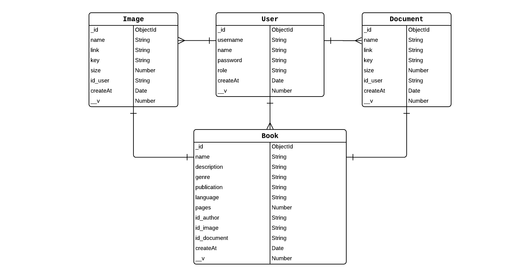

<h1 align="center">
  🚀 Lebook Back-End 🚀
</h1>

 

<space><space>

  

## Overview

API of the e-book platform, developed in NodeJS, Express and MongoDB.

- **[Logical Model](#logical-model)**
- **[Author](#author)**
- **[License](#license)**
- **[Show your support](#show-your-support)**

  

## Logical Model

  

## Author

👤 **[Eduardo Mauricio](https://github.com/therealeddy)**

## License

MIT © **[License](LICENSE)**

## Show your support

Give a ⭐️ if this project helped you!
